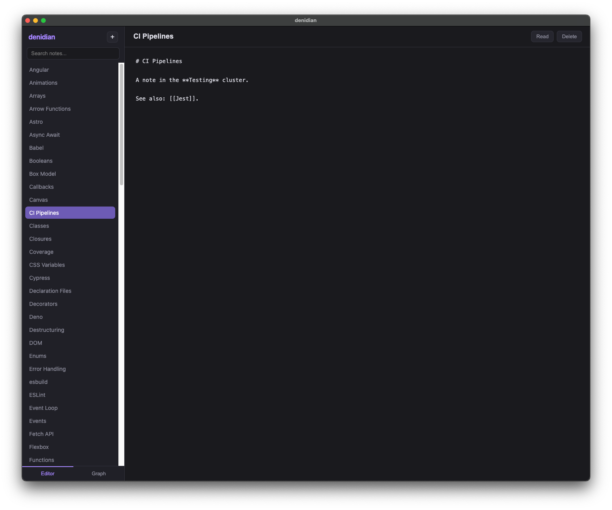
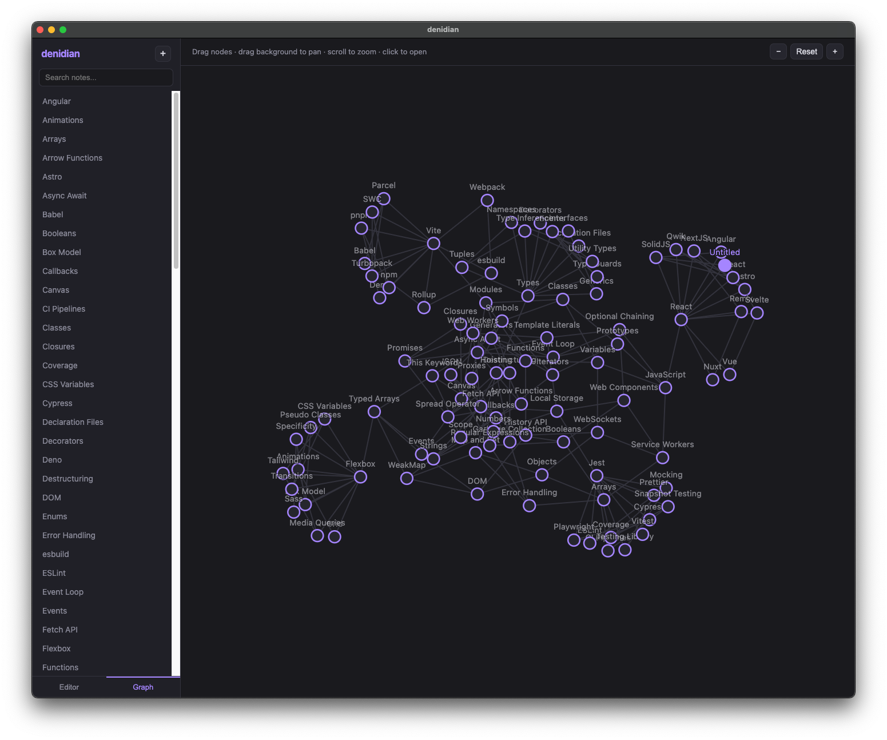

# denidian

A tiny [Obsidian](https://obsidian.md)-style note app built on the new
**`deno desktop`** subcommand ([denoland/deno#33441](https://github.com/denoland/deno/pull/33441)).
Notes are plain Markdown files, you cross-link them with `[[wikilinks]]`, and a
force-directed graph shows how they connect.

It's deliberately small — a single Deno HTTP server plus a vanilla
HTML/CSS/JS frontend, no framework and no build step for the UI.





## Features

- **Notes** — create, rename, edit, and delete Markdown notes from the sidebar,
  with live search. Everything is stored as `.md` files in `~/Denidian`, so the
  vault is just a folder of plain text you fully own.
- **Crosslinking** — type `[[Note title]]` to link notes. In read mode links
  render as clickable chips; clicking a link to a note that doesn't exist yet
  creates it.
- **Live preview** — toggle between a Markdown editor and a rendered view
  (headings, lists, code, blockquotes, bold/italic, links, and wikilinks).
- **Graph view** — a force-directed diagram of every note and its `[[links]]`.
  The layout pre-settles instantly, and you can drag nodes, drag the background
  to pan, scroll (or use the +/−/Reset buttons) to zoom, and click a node to
  open that note.

## How it works

`deno desktop` runs a normal Deno program and points a native window's embedded
webview at a local HTTP server. denidian leans into that:

```
┌─────────────────────────── deno desktop ───────────────────────────┐
│                                                                     │
│   main.ts  ── Deno.serve() ──►  http://127.0.0.1:<random port>      │
│     │                                  ▲                            │
│     │ reads/writes                     │ webview navigates here     │
│     ▼                                  │                            │
│   ~/Denidian/*.md                 native window (Deno.BrowserWindow)│
│                                        │                            │
│                                   web/ (index.html, app.js, style)  │
└─────────────────────────────────────────────────────────────────────┘
```

- **`main.ts`** is the whole backend. On startup it ensures the vault directory
  `~/Denidian` exists, seeds it with a starter set of notes if it's empty, and
  (in a desktop build) adopts the startup window via `Deno.BrowserWindow` to set
  the title and a 2000×1000 size. Then `Deno.serve()` handles everything:

  - `GET /` and other paths → static files from `web/`.
  - `GET /api/notes` → list of `{ name, links }` for every note (links are
    parsed from `[[wikilinks]]` server-side).
  - `GET /api/notes/:name` → `{ name, content }` for one note.
  - `PUT /api/notes/:name` → save a note's Markdown.
  - `DELETE /api/notes/:name` → delete a note.

  In a `deno desktop` build the port is chosen by the runtime (via the
  `DENO_SERVE_ADDRESS` env var) and the webview navigates to it automatically —
  there's no port to manage.

- **`web/`** is the frontend, served as plain static files:
  - `index.html` — the shell (sidebar, editor/preview panes, graph view).
  - `style.css` — a dark Obsidian-like theme.
  - `app.js` — all the client logic: fetches the notes API, renders Markdown +
    wikilinks, autosaves edits (debounced), and draws the SVG graph. The graph
    runs a small force simulation (repulsion + springs + centering) for ~400
    steps up front so it appears settled immediately, then only re-simulates
    while you drag.

Because it's just `Deno.serve()`, the exact same code runs in a normal browser
for development — handy for iterating on the UI without rebuilding.

## The vault

Notes live in `~/Denidian` as one `.md` file per note (the note title is the
filename). Edit them with denidian, any text editor, or sync them however you
like — there's no database or lock-in. Delete the folder to reset; denidian
re-seeds a starter vault on next launch.

The starter vault is JS/Web-dev themed: one dense "JavaScript core" cluster of
45 notes surrounded by five satellite clusters (Frameworks, Build Tools,
TypeScript, CSS & Styling, Testing) so the graph view has interesting structure
out of the box.

## Running it

```sh
deno task dev        # desktop window with hot reload
deno task start      # desktop window
deno task build      # produce ./dist/Denidian.app

deno run -A main.ts  # plain browser dev at http://localhost:8000
```

The app needs read/write/env permissions (for the vault and `$HOME`), which the
tasks grant with `-A`. The UI assets in `web/` are embedded into the compiled
binary via `--include ./web`.

## Building for distribution

Prebuilt downloads are on the
[releases page](https://github.com/bartlomieju/denidian/releases):

| Platform        | Download                                  |
| --------------- | ----------------------------------------- |
| macOS (Apple)   | `denidian-aarch64-apple-darwin.dmg`       |
| macOS (Intel)   | `denidian-x86_64-apple-darwin.dmg`        |
| Linux (x86_64)  | `denidian-x86_64-unknown-linux-gnu.AppImage` |
| Windows (x86_64)| `denidian-x86_64-pc-windows-msvc.zip`     |

`deno desktop` cross-compiles for every platform from a single machine — it
downloads the matching prebuilt runtime and UI backend, so no per-platform
toolchain is needed. The output format is chosen by the file extension.

```sh
# Each target downloads its backend on first build.
deno desktop -A --include ./web --backend webview \
  --target aarch64-apple-darwin --output dist/denidian-aarch64-apple-darwin.dmg main.ts

deno desktop -A --include ./web --backend webview \
  --target x86_64-apple-darwin --output dist/denidian-x86_64-apple-darwin.dmg main.ts

deno desktop -A --include ./web --backend webview \
  --target x86_64-unknown-linux-gnu --output dist/denidian-x86_64-unknown-linux-gnu.AppImage main.ts

deno desktop -A --include ./web --backend webview --icon ./icons/app.ico \
  --target x86_64-pc-windows-msvc --output dist/denidian-x86_64-pc-windows-msvc main.ts
```

Supported targets: `aarch64-apple-darwin`, `x86_64-apple-darwin`,
`x86_64-unknown-linux-gnu`, `aarch64-unknown-linux-gnu`,
`x86_64-pc-windows-msvc`. Build them all at once with `--all-targets`.

### Backends and size

`--backend webview` uses the operating system's built-in webview (WKWebView on
macOS, WebView2 on Windows, WebKitGTK on Linux), which keeps the download small
— denidian is ~30 MB per platform. The alternative, `--backend cef`, bundles
Chromium for pixel-identical rendering everywhere, at the cost of size (~150 MB+
on macOS, ~375 MB as a Linux AppImage). For an app this simple, webview is the
better trade, and it's the default in `deno.json` and the tasks above.

Output formats are picked from the extension: macOS `.app`/`.dmg`, Linux
`.AppImage` (or a plain directory), Windows directory (zip it to distribute).
The macOS `.dmg` is produced with `hdiutil`, so it must be built on a macOS
host; everything else cross-compiles from anywhere.

## Project layout

```
denidian/
├── main.ts          # Deno server: static UI + notes API + vault + window
├── deno.json        # desktop config (name, icon, backend) and tasks
├── web/
│   ├── index.html   # app shell
│   ├── style.css    # dark theme
│   └── app.js       # frontend: Markdown, wikilinks, graph
└── icons/
    ├── icon.svg     # source icon (a little node-graph glyph)
    ├── app.icns     # macOS app icon
    ├── app.ico      # Windows app icon
    └── app-512.png  # Linux app icon
```
